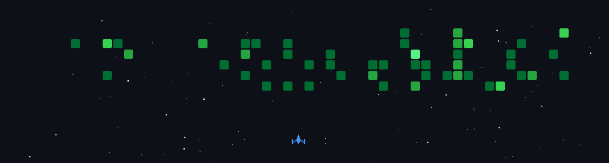

# 💫 About Me:
🔭 I’m currently working on an AR aggression training app which utilizes AI to provide feedback to the users 👯 I’m looking to collaborate on innovative and new ideas that empowers people 💬 Ask me about product/program management, management in general and innovation ⚡ Fun fact in my free time I'm working as a shiftleader operation for a supermarket in my neighbourhood

## 🌐 Socials:
  

# 💻 Tech Stack:
                
# 📊 GitHub Stats:
 
 

### ✍️ Random Dev Quote

### 🔝 Top Contributed Repo

---

<!-- Proudly created with GPRM ( https://gprm.itsvg.in ) -->

